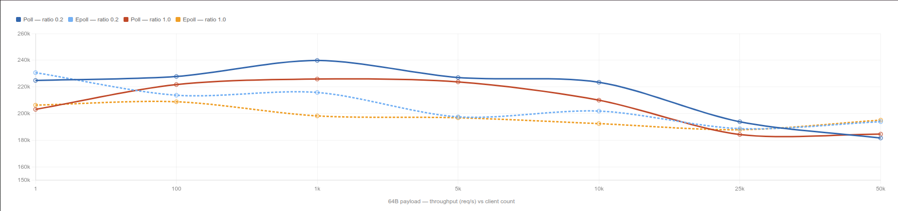
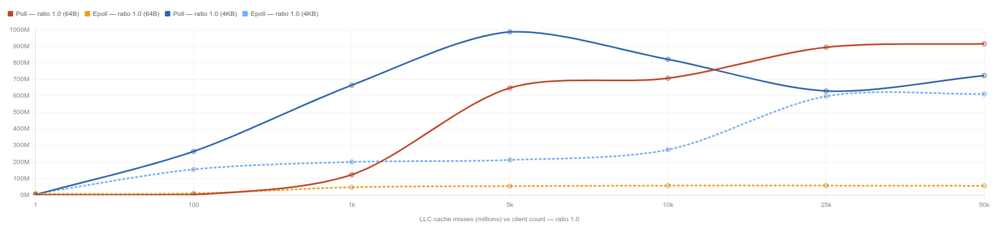
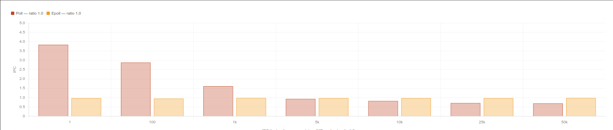
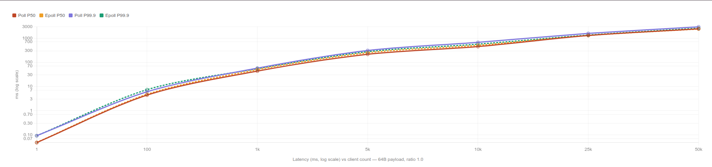
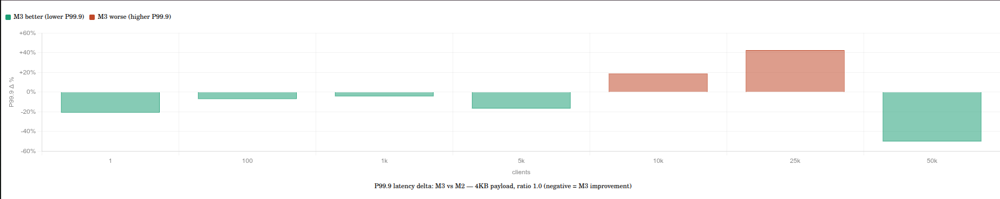
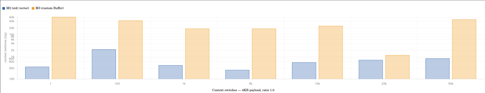
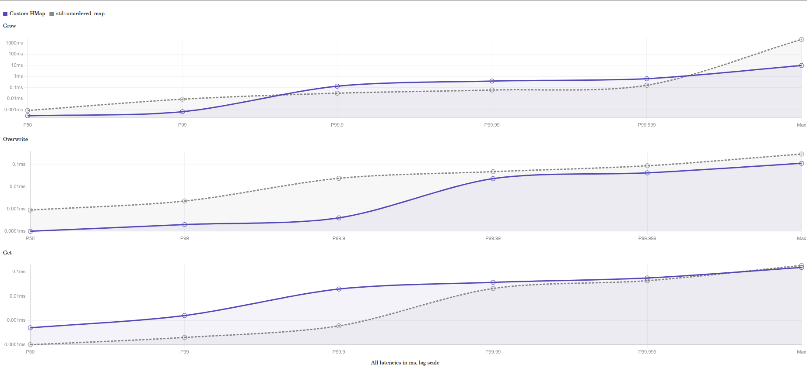

# mini-redis-from-scratch

A Redis-inspired, single-threaded in-memory datastore written in C++17 to learn systems fundamentals from first principles:

- socket programming and custom binary protocols
- non-blocking I/O and event loops (`poll` -> `epoll`)
- robust connection lifecycle handling
- custom memory-efficient buffering
- intrusive hash table with progressive rehashing
- intrusive AVL tree + hash map hybrid sorted set (`ZSet`)
- protocol parsing, typed serialization, and defensive validation

This project intentionally builds the server step-by-step (from echo server to typed KV + sorted sets), with tests added at each milestone.

## Current Status

- Main server backend: `epoll` (edge-triggered, non-blocking)
- Legacy backend for learning: `poll` server
- Client: command-line binary protocol client
- Data types: `string`, `int64`, `double`, `zset`
- Command families: KV + numeric + type introspection + sorted set operations
- License: MIT

## Table of Contents

1. [Why This Project](#why-this-project)
2. [Architecture Overview](#architecture-overview)
3. [Repository Layout](#repository-layout)
4. [Build and Run](#build-and-run)
5. [Wire Protocol](#wire-protocol)
6. [Command Reference](#command-reference)
7. [Core Data Structures](#core-data-structures)
8. [Testing](#testing)
9. [Robustness and Security Notes](#robustness-and-security-notes)
10. [Project Evolution (Commit Milestones)](#project-evolution-commit-milestones)
11. [Known Limitations](#known-limitations)
12. [Benchmarks](#benchmarks)
13. [Active Development: TTL & Heaps](#active-development-ttl-heaps)

## Why This Project

The goal is educational depth, not feature parity with Redis:

- implement protocol and networking manually
- understand TCP stream framing and pipelining
- practice safe non-blocking state machines
- build core DS primitives instead of relying on STL maps for everything
- reason about latency behavior (especially tail latency under rehashing)

## Architecture Overview

The runtime data path in the main server (`server_epoll.cpp`) is:

1. Accept client connections on port `1234`
2. Set each socket non-blocking
3. Use `epoll` (`EPOLLET`) for readiness notifications
4. Read available bytes into per-connection `incoming` buffer
5. Parse framed request(s) with `try_one_request()`
6. Dispatch to command handlers (`do_request`)
7. Serialize typed response into `outgoing` buffer
8. Flush writes when socket becomes writable
9. Defer connection destruction until the end of the `epoll_wait` batch

## Repository Layout

```text
.
├── server_epoll.cpp        # Main epoll event loop
├── server_poll.cpp         # Earlier poll-based learning server (echo-style)
├── client.cpp              # CLI client for sending commands
├── io_handlers.{h,cpp}     # accept/read/write handlers for epoll server
├── conn.{h,cpp}            # connection objects and destruction helpers
├── protocol.{h,cpp}        # request framing + parse + dispatch glue
├── serialization.{h,cpp}   # TLV response serialization + request decode helpers
├── commands.{h,cpp}        # command dispatch + global DB state
├── commands_kv.cpp         # GET/SET/DEL/INCR/TYPE/KEYS handlers
├── commands_zset.cpp       # ZADD/ZREM/ZSCORE/ZQUERY/ZRANK/ZCOUNT handlers
├── buffer.{h,cpp}          # custom growable buffer with O(1) consume
├── hashtable.{h,cpp}       # intrusive chaining hashmap + progressive rehashing
├── avl.{h,cpp}             # intrusive AVL tree with rank/offset support
├── zset.{h,cpp}            # sorted set built from AVL + hashmap
├── utils.{h,cpp}           # hash, parse helpers, socket read/write utilities
├── tests/
  ├── tests_protocol.cpp
  ├── tests_kv_commands.cpp
  ├── tests_zset_commands.cpp
  ├── tests_avl.cpp
  ├── tests_zset.cpp
  └── tests_helpers.h
```

---

## Build and Run

### Prerequisites

- Linux (epoll is Linux-specific)
- `g++` with C++17 support

### Build main server

```bash
g++ -O2 -Wall -Wextra -std=c++17 \
  server_epoll.cpp conn.cpp io_handlers.cpp protocol.cpp serialization.cpp \
  commands.cpp commands_kv.cpp commands_zset.cpp buffer.cpp hashtable.cpp \
  zset.cpp avl.cpp utils.cpp -o server_epoll
```

### Build client

```bash
g++ -O2 -Wall -Wextra -std=c++17 client.cpp utils.cpp -o client
```

### Optional: build legacy poll server

```bash
g++ -O2 -Wall -Wextra -std=c++17 server_poll.cpp utils.cpp -o server_poll
```

### Run

Terminal 1:

```bash
./server_epoll
```

Terminal 2:

```bash
./client set mykey hello
./client get mykey
./client setint counter 41
./client incr counter
./client type counter
./client keys
```

---

## Wire Protocol

### Transport framing

Every message (request or response) is framed as:

- 4-byte unsigned length header in network byte order (`htonl`/`ntohl`)
- followed by `length` payload bytes

Maximum payload size is `32 MiB`.

### Request payload format

A request payload is a vector of strings:

```text
[u32 n_args][u32 len_0][bytes arg_0]...[u32 len_n][bytes arg_n]
```

Example logical command:

```text
["set", "mykey", "hello"]
```

### Response payload format (TLV)

Responses are serialized as tagged values:

- `TAG_NIL = 0`
- `TAG_ERR = 1`
- `TAG_STR = 2`
- `TAG_INT = 3`
- `TAG_DBL = 4`
- `TAG_ARR = 5`

Payload details:

- `NIL`: tag only
- `ERR`: tag + error code (u32) + message length (u32) + bytes
- `STR`: tag + length (u32) + bytes
- `INT`: tag + int64 (big-endian)
- `DBL`: tag + IEEE754 bits as u64 (big-endian)
- `ARR`: tag + element count (u32) + nested TLVs

### Response framing helpers

The server uses `response_begin()` and `response_end()` to:

- reserve header space
- serialize body
- backfill true body length
- downgrade oversized responses to `ERR_TOO_BIG`

### Limits and validation

- max message size: `32 MiB`
- max args per request: `200000`
- malformed/truncated requests close the client connection
- over-sized headers cause disconnect

---

## Command Reference

All commands are lowercase in current handler dispatch.

### KV and numeric commands

| Command | Args | Behavior | Return |
|---|---|---|---|
| `get` | `key` | Fetch value by key | native type (`str`, `int`, `dbl`) or `nil` |
| `set` | `key value` | Store string | `nil` |
| `setint` | `key int64` | Store integer (strict parse) | `nil` or type error |
| `setdbl` | `key double` | Store finite double (reject `inf`/`nan`) | `nil` or type error |
| `del` | `key` | Delete key | `1` if deleted, `0` otherwise |
| `keys` | none | List all keys | `arr[str, ...]` |
| `incr` | `key` | Increment int64 by 1 (auto-create missing key) | new integer value |
| `incrby` | `key delta` | Add signed int64 delta (auto-create missing key) | new integer value |
| `type` | `key` | Inspect stored type | `"string"`, `"int"`, `"double"`, `"zset"`, or `nil` |

Notes:

- `incr`/`incrby` protect against signed overflow
- type mismatches return structured `TAG_ERR`
- values are binary-safe strings where applicable

### Sorted set commands

| Command | Args | Behavior | Return |
|---|---|---|---|
| `zadd` | `key score member` | Insert/update member score | `1` if inserted, `0` if updated |
| `zrem` | `key member` | Remove member | `1` if removed, `0` if missing |
| `zscore` | `key member` | Read member score | `double` or `nil` |
| `zquery` | `key score name offset limit [asc/desc]` | Seek from `(score,name)` and scan | flat array `[name, score, ...]` |
| `zrank` | `key member` | 0-based rank in sorted order | `int` or `nil` |
| `zcount` | `key min max` | Count scores in `[min, max)` | `int` |

Sorted order is `(score ASC, name ASC)` for ties.

Type safety is enforced both ways:

- KV ops on zset keys return type errors where applicable
- zset ops on non-zset keys return `expect zset`

---

## Core Data Structures

### 1) `Buffer` (custom dynamic byte buffer)

Why it exists:

- avoid `std::vector` front-erase costs in long-lived connections

Key properties:

- O(1) consume via moving read pointers
- deferred compaction
- amortized O(1) growth
- explicit OOM checks for `realloc`
- move semantics for safe ownership transfer
- optional shrink-to-zero after full consume to avoid memory high-water bloat
- zero-initialization in `resize` to avoid stale heap byte leakage into response payloads

### 2) `HMap` (intrusive chaining hash map)

Why it exists:

- control resize behavior and tail latency

Design:

- two-table model: `newer` + `older`
- progressive migration (`hm_help_rehashing`) in bounded work chunks
- new inserts land in `newer`
- lookups/deletes check both tables

Benefit:

- avoids long blocking pauses from full-table rehashing

### 3) `AVL` tree (intrusive self-balancing BST)

Features:

- rotations with LR/RL double-rotation handling
- subtree node counts (`cnt`) for rank and offset operations
- deletion with successor swap
- `avl_offset` and `avl_rank` helpers for order statistics

### 4) `ZSet` hybrid (AVL + HMap)

Combines:

- AVL for ordered operations (`seek`, `rank`, `offset`, `count`)
- hash map for O(1) member lookup by name

Per-member node embeds both intrusive nodes (`AVLNode` + `HNode`) and stores flexible-array member name bytes.

---

## Testing

The project includes both integration tests (against running server) and unit tests (data structures only).

### Build test binaries

```bash
g++ -O2 -Wall -Wextra -std=c++17 tests/tests_protocol.cpp utils.cpp -o tests_protocol
g++ -O2 -Wall -Wextra -std=c++17 tests/tests_kv_commands.cpp utils.cpp -o tests_kv_commands
g++ -O2 -Wall -Wextra -std=c++17 tests/tests_zset_commands.cpp utils.cpp -o tests_zset_commands
g++ -O2 -Wall -Wextra -std=c++17 tests/tests_avl.cpp avl.cpp utils.cpp -o tests_avl
g++ -O2 -Wall -Wextra -std=c++17 tests/tests_zset.cpp zset.cpp avl.cpp hashtable.cpp utils.cpp -o tests_zset
```

### Run tests

Start server first for integration tests:

```bash
./server_epoll
```

Then run:

```bash
./tests_protocol
./tests_kv_commands
./tests_zset_commands
./tests_avl
./tests_zset
```

### Test coverage highlights

`tests_protocol.cpp`:

- pipelining and fragmentation
- 32MB payload integrity
- reconnect churn
- malformed/truncated request handling
- oversized-header rejection
- concurrent client stress

`tests_kv_commands.cpp`:

- unknown command handling
- arg-count validation
- binary-safe keys/values
- `SETINT`/`SETDBL` parse checks
- `INCR`/`INCRBY` arithmetic/type errors
- `TYPE` and cross-type overwrites

`tests_zset_commands.cpp`:

- full zset CRUD flow
- range queries, rank, count
- zset type safety and GC behavior
- wrong-arity command checks

`tests_avl.cpp` and `tests_zset.cpp`:

- structural invariants
- exhaustive offset/rank/order checks
- random insert/delete validation

---

## Robustness and Security Notes

The server explicitly defends against common protocol and event-loop failure modes:

- malformed request bodies
- truncated/partial payload attacks
- oversized message headers
- read/write `EINTR` handling
- non-blocking `EAGAIN`/`EWOULDBLOCK` handling
- event-batch-safe deferred teardown (UAF/ABA mitigation)

---

## Project Evolution (Commit Milestones)

1. **Socket basics and client/server foundation**  
   Built working TCP client/server using `socket`, `bind`, `listen`, `accept`, `connect`, plus `getaddrinfo` for IPv4/IPv6-friendly resolution.

2. **Length-prefixed binary framing and reliable I/O helpers**  
   Standardized messages as `[4-byte length][payload]`. Added `read_full` and `write_full` to properly handle partial I/O and `EINTR`.

3. **Blocking -> non-blocking with `poll`**  
   Moved to multiplexed single-threaded architecture, introduced connection state objects, request pipelining loop, and buffered read/write behavior.

4. **`epoll` backend with edge-trigger discipline**  
   Replaced `poll` path with ET `epoll`, requiring strict socket draining. Added tests around 32MB payloads, pipelining, and reconnect behavior.

5. **Modularization + critical lifecycle fix + better buffering**  
   Split server into `conn`, `protocol`, `io_handlers`. Fixed event-batch UAF/ABA hazards via deferred destroy. Replaced vector front-erase buffering with custom `Buffer`.

6. **Echo -> real KV protocol**  
   Shifted from echo semantics to command-based KV datastore. Strengthened invalid-input handling and expanded malicious input tests.

7. **Custom hash map with progressive rehashing**  
   Replaced STL map usage in datastore path with intrusive `HMap` for better tail-latency behavior during growth.

8. **Typed TLV serialization and command expansion**  
   Introduced response tags (`nil/err/str/int/dbl/arr`), typed value storage, command growth (`SETINT`, `SETDBL`, `INCR`, `INCRBY`, `TYPE`, `KEYS`), and protocol/serialization modular split.

9. **AVL tree subsystem + exhaustive tests**  
   Added intrusive AVL implementation with balancing, deletion, rank/offset helpers, and strong invariant-driven unit tests.

10. **Sorted sets milestone (`ZSet`)**  
    Added AVL+hash hybrid sorted sets with `ZADD`, `ZREM`, `ZSCORE`, `ZQUERY`, `ZRANK`, `ZCOUNT`, plus broad integration and unit coverage.

## Known Limitations

- Not RESP-compatible yet (uses custom binary protocol)
- Single-threaded event loop
- No persistence (in-memory only)
- No replication, transactions, TTL/expiry, auth, or ACLs
- No eviction policy
- Command set is intentionally limited

---

## Benchmarking Methodology

To ensure unbiased and reproducible performance metrics, developed a rigorous benchmarking suite using `libuv` and `perf`. Methodology prioritizes system-level isolation to capture the true architectural impact of each milestone.

### 1. Environment & Isolation
*   **CPU Pinning**: The server is pinned to Core 0 (`taskset -pc 0`), while the benchmarking clients are pinned to Cores 1-3 to avoid cache-line interference and frequent context switches between server/client processes.
*   **Warm-up Phase**: Each test begins with 1,000 requests (4KB payload) to warm up the CPU's Instruction Cache (i-cache) and fill the server's internal buffers to a "Steady State."
*   **System Tuning**: Explicitly disable `stdout`/`stderr` logging during runs to eliminate I/O-induced context switching and locks.

### 2. The Benchmark Matrix
Tested every milestone against three primary variables:
*   **Concurrency**: 1 to 50,000 simultaneous connections.
*   **Payload Size**: 
    *   **64B**: To measure pure event-loop/system call overhead.
    *   **4KB**: A "real-world" scenario for standard KV pairs.
*   **Active Ratio**: Simulating realistic load where only a subset of connected clients (e.g., 20% or 100%) are actively sending requests at any given microsecond.

### 3. Statistical Rigor
For every configuration, we run the suite 3-5 times and distill results using the following standards:
*   **Throughput (req/s)**: Reported as the **Mean (Average)** to smooth out minor OS jitter.
*   **Latency (P50, P99)**: Reported as the **Median** to filter out rare scheduling spikes.
*   **Tail Latency (P99.9 & Max)**: Reported as the **Maximum** over all runs to prove that our progressive hashing or memory management never "freezes" the server.
*   **Hardware Counters**: Using `perf stat`, we capture the **Minimum** value for **Cache Misses** and **Context Switches** to represent the cleanest possible run without background OS pollution.
*   **IPC (Instructions Per Cycle)**: Recalculated using $\text{IPC} = \frac{\text{Stable Instruction Count}}{\text{Minimum Cycles}}$ to measure CPU pipeline efficiency.

---

## Poll vs. Epoll: Benchmarking Analysis

### Summary

The benchmarks confirm the theoretical $O(N)$ vs $O(M)$ distinction between `poll` and `epoll`, but the story is more nuanced than raw throughput numbers suggest. At low client counts, `poll` is actually *faster*. The architectural gap only becomes operationally meaningful above ~5,000 connections, and it manifests most visibly in cache efficiency and tail latency — not in headline throughput. The most dramatic finding is `poll`'s near-collapse at 50,000 clients under a 4KB payload at full saturation (24,147 req/s vs `epoll`'s 58,820 req/s), revealing a hard scalability cliff that throughput averages obscure until it's too late.

### 1. Throughput scaling

The throughput story depends heavily on which lens you use. Several patterns stand out. 



Under sporadic load (ratio 0.2), `poll` actually *outperforms* `epoll` at the 1,000–10,000 client range, peaking at 239,878 vs 215,831 req/s at 1,000 clients. This is counterintuitive but explainable — at these intermediate scales, the overhead of `epoll`'s edge-triggered event dispatch and the associated context switches (14,000+ vs ~570 for `poll`) outweighs its benefit. `poll`'s $O(N)$ scan is still cheap enough to win.

The crossover happens around 25,000–50,000 clients. At 50,000 clients under full saturation, `epoll` leads by 5.7% on throughput, but this modest number masks a catastrophic divergence in hardware efficiency (see section 3).

### 2. The cache miss story

This is where `epoll`'s architectural superiority is unambiguous and dramatic. 



The divergence is stark. For the 64B payload at full saturation, `poll`'s cache misses escalate from 2M at 1 client to 915M at 50,000 clients — a 457x increase. `epoll` stays essentially flat: 8M at 1 client, 57M at 50,000 clients. That is a **16x reduction** in cache pressure at peak scale.

The root cause is structural. When `poll()` wakes up, it must traverse the entire file descriptor array (up to 50,000 entries) in kernel space to find which sockets are ready. Each iteration that touches a cold cache line — a socket struct that hasn't been accessed recently because it's been idle — is an LLC miss. As the pool of idle connections grows, the fraction of wasted traversal grows with it, and the cache is constantly evicted. `epoll`, by contrast, maintains a persistent interest list in kernel space and only delivers the $M$ ready file descriptors. The working set it touches is bounded by `M`, not `N`.

The 4KB payload shows a less dramatic but still clear advantage for `epoll`, because at larger payloads the bottleneck shifts partially toward `send`/`recv` data copy costs and `std::vector` buffer management — masking some of the event-loop cache pressure.

### 3. CPU pipeline efficiency (IPC)



The IPC chart tells a compelling story about CPU pipeline health. `epoll`'s IPC is almost perfectly flat across all scale points, hovering between 0.95–0.98 regardless of connection count. It is doing the same quality of work at 50,000 clients as at 1 client. `poll`, by contrast, starts high — 3.83 IPC at 1 client under full saturation, because with only one file descriptor the scan is trivial and the CPU executes a tight, predictable loop — but degrades to 0.69 IPC at 50,000 clients.

The decline is a direct consequence of cache misses. When the CPU's load instructions hit the LLC and miss, the execution unit stalls waiting for DRAM (typically 100–200 ns). Instructions-per-cycle measures how often the execution unit is actually doing work vs stalling. `poll`'s 0.69 IPC at 50,000 clients means the core is stalled for nearly a third of every cycle, waiting for data the cache no longer holds.

There is an interesting artifact at 1 client with ratio 1.0: `poll`'s IPC spikes to 3.83 (vs `epoll`'s 0.97). With only one socket, `poll` scans a single-element array — a nearly trivial branch-free tight loop — and the processor can speculatively execute far ahead, achieving superscalar throughput. `epoll`'s edge-triggered dispatch introduces slightly more diverse code paths, keeping it at 0.97. This single-client advantage is operationally irrelevant but methodologically important: it confirms the benchmark's isolation is good.

### 4. The context switch paradox

One of the more surprising findings in the data is that `epoll` generates **50–87x more context switches** than `poll` at equivalent workloads. At 50,000 clients with a 64B payload (ratio 1.0), `epoll` produces 16,862 context switches vs `poll`'s 313.

This is often cited as evidence of overhead, but it is actually a sign of *better* behavior. The explanation lies in how each system interacts with the OS scheduler.

`poll`'s `O(N)` scan is so computationally expensive per wakeup that the process consumes its entire scheduler quantum doing kernel-space work. The OS sees a compute-bound process and rarely preempts it. The low context switch count reflects the kernel never getting a chance to run other work — not that `poll` is being cooperative.

`epoll`, having found the ready events almost instantly, completes its kernel-space work and returns to user space quickly, where the process naturally yields or is preempted while doing I/O. More context switches indicate that the process is shorter-lived in kernel space per event, not more disruptive to the system overall.

The practical consequence shows up in P99.9 tail latency at 50,000 clients under full saturation (64B): `epoll` achieves 2,596 ms vs `poll`'s 2,949 ms — a 12% improvement in worst-case jitter, despite `poll` holding the CPU longer per wakeup.

### 5. Latency under load



The latency picture has a surprising twist: `poll` actually shows *lower* P50 latency at high client counts (64B, ratio 1.0). At 10,000 clients, `poll` P50 is 449 ms vs `epoll`'s 508 ms. This is the same phenomenon as the throughput crossover — `poll`'s aggressively long kernel residence per wakeup processes a larger batch of work before yielding, which can reduce median round-trip time by amortizing syscall overhead across more requests.

However, `epoll` consistently wins on **P99.9 tail latency** once scale exceeds ~5,000 clients. At 10,000 clients, `epoll` tail is 567 ms vs `poll`'s 672 ms (15.5% better). At 50,000 clients, the gap widens to 2,596 ms vs 2,949 ms (12% better). This matters for production SLAs: the P50 difference is a scheduling artifact, but the P99.9 difference reflects genuine service quality for the unluckiest requests.

### 6. The scalability cliff — 4KB payload at 50,000 clients

The single most important data point in the entire dataset is the 50,000-client, 4KB, ratio 1.0 row:

| Metric | Poll | Epoll |
|:---|---:|---:|
| Throughput (req/s) | 24,147 | 58,820 |
| P99.9 latency (ms) | 105,917 | 106,458 |
| Cache misses | 723M | 612M |

`poll` has collapsed to 24,147 req/s — a **86.9% drop** from its own 1-client performance (157,056 req/s). `epoll` degraded to 58,820 req/s — a 63.8% drop, and still 2.4x faster than `poll` at the same configuration.

The P99.9 latency for both exceeds 100 seconds, indicating the system is severely overloaded. But the key finding is that `poll`'s degradation is disproportionate. As payload size grows, each `poll` wakeup pays both the `O(N)` scan cost *and* the increased per-socket data processing cost. These two costs multiply rather than add. `epoll`'s `O(M)` scan cost is effectively constant, so only the data processing cost scales — a qualitatively different failure mode.

This is the practical meaning of `O(N)` scaling: it doesn't just degrade gracefully, it introduces a second-order interaction with payload size and active ratio that can turn a 5% performance gap into a system-threatening collapse.

### 7. Active ratio impact — epoll's sweet spot

The active ratio dimension confirms `epoll`'s design intent most cleanly. At 50,000 clients (64B):

| Ratio | Poll | Epoll | Delta |
|:---|---:|---:|---:|
| 1.0 (all active) | 184,589 | 195,087 | +5.7% epoll |
| 0.2 (20% active) | 181,653 | 193,917 | +6.7% epoll |

Both ratios show similar raw throughput differences. But the *mechanism* differs fundamentally. Under ratio 1.0, `poll` is paying an `O(N)` scan cost that is at least somewhat "productive" — most sockets it checks are actually ready. Under ratio 0.2, `poll` checks 50,000 sockets but only 10,000 are ready — 80% of its scan is pure waste. That `poll` still achieves similar absolute throughput reflects that the event-loop overhead is not the sole bottleneck; data copy and buffer management dominate at this payload. But the cache miss penalty still climbs (854M vs 58M at ratio 0.2), and `epoll`'s lead on P99.9 tail latency correspondingly widens.

In real-world deployments where connections are predominantly idle (chat systems, long-polling APIs, connection-pooled databases), this ratio effect is the dominant consideration. `poll` must scan every connection regardless of whether any are ready; `epoll` has no idle-connection tax at all.

### 8. Conclusion

**Where `poll` wins:** 1–1,000 clients, especially under sporadic load. The `O(N)` scan is cheap at small `N`, context switch overhead is avoided, and `poll` can squeeze slightly higher IPC in tight-loop conditions. For embedded systems, simple CLIs, or microservices with bounded connection pools well under 1,000, `poll` is adequate and has no epoll-specific complexity.

**Where `epoll` wins:** Everything above ~5,000 connections, and decisively above 10,000. The 16x cache miss reduction, stable IPC regardless of `N`, lower P99.9 tail latency, and near-immunity to the idle-connection problem make it the only viable choice for general-purpose servers. The 4KB/50k/ratio-1.0 result makes this non-negotiable: `poll` cannot be safely relied upon in production environments where peak connection counts may spike.

**The key architectural insight the data validates:** Throughput is a deceptive metric for this comparison. Two systems can deliver similar req/s while one is thrashing LLC caches, running at 0.69 IPC, and accumulating latency jitter that only shows at the P99.9 tail. The benchmarks demonstrate that `epoll`'s advantage is primarily about *stability and predictability* as `N` grows — not headline performance — until `N` is large enough that the `O(N)` scan cost finally overwhelms `poll`'s throughput entirely, at which point the failure is abrupt rather than gradual.

## std::vector vs. Custom Buffer: Benchmarking Analysis

### Summary

The custom buffer class implementation delivers genuine but modest gains under conditions where deferred compaction works as intended: medium concurrency (100–5,000 clients) with larger payloads. Under small payloads, the difference is indistinguishable from noise. Under extreme concurrent load at 4KB, deferred compaction turns from an asset into a serious liability, cutting throughput in half at 50,000 clients. The std::vector implementation baseline is more predictable across the full operating envelope.

### 1. The 64B null result

Across all client counts and active ratios with a 64B payload, the deltas between std::vector implementation and custom buffer class implementation are essentially noise. IPC is stable at 0.96–0.98 for both. Cache misses differ by 1–10%, which at these absolute magnitudes (8–65M) represents a few milliseconds of difference across the entire run. Throughput deltas are all within ±3.5%, consistent with run-to-run measurement variance.

This is the expected result. With 64-byte payloads, each `consume()` in `std::vector` triggers a `memmove()` of at most 64 bytes — an operation that completes in a handful of nanoseconds and fits entirely within a cache line. The entire cost the custom buffer class implementation is designed to avoid is essentially free at this payload size. The event loop and syscall overhead dominate both implementations equally. No conclusion about buffer design can be drawn from this dataset.

### 2. The 4KB medium-concurrency win

This is where the custom buffer class implementation's design intent is fulfilled. Across 100–5,000 clients with 4KB payloads, custom buffer class implementation consistently improves throughput slightly and — more importantly — reduces P99.9 tail latency meaningfully:



| Clients | Ratio | Throughput Δ | P99.9 Δ |
|:---|:---|---:|---:|
| 1 | 1.0 | −0.1% | −20.8% |
| 100 | 1.0 | +2.7% | −7.0% |
| 1,000 | 1.0 | +2.5% | −4.3% |
| 5,000 | 1.0 | +0.5% | −16.7% |

These are real improvements. At 5,000 clients, P99.9 falls from 416 ms to 346 ms, a 16.7% reduction, while throughput holds flat. The mechanism is straightforward: `std::vector::erase(begin(), begin()+n)` calls `memmove()` on every request consume, shifting the remaining buffer contents back to index 0. With 4KB payloads, that's a 4KB move per consumed message — small but non-trivial. The custom buffer class implementation's `consume()` avoids this entirely by advancing `data_start`, deferring any compaction until `append()` actually needs space. When the buffer reaches a steady-state cycle where space is always available without compaction, the deferred cost may never be paid at all.

IPC and cache misses show no meaningful difference in this range, confirming the gain is specifically from eliminating per-consume memory copies, not from any broader cache efficiency improvement.

### 3. The high-concurrency failure

The picture reverses sharply above 10,000 clients under full saturation.At 10,000 clients (ratio 1.0, 4KB), custom buffer class implementation's P99.9 spikes 18.7% above std::vector implementation (2,939 ms → 3,490 ms). At 25,000 clients, the P99.9 regression reaches 42.6% (5,677 ms → 8,096 ms). The 50,000-client data point requires separate treatment below.

Note the −50.1% bar at 50,000 clients appears as an improvement but is misleading — it is explained in section 4.

### 4. The 50,000-client collapse and the compaction thundering herd

The 50,000-client, 4KB, ratio 1.0 data point is the most alarming in the dataset:

| Metric | std::vector implementation | custom buffer class implementation | Δ |
|:---|---:|---:|---:|
| Throughput (req/s) | 58,820 | 29,407 | −50% |
| P50 latency (ms) | 2,319 | 3,406 | +46.9% |
| P99.9 latency (ms) | 106,458 | 53,116 | −50.1% |
| Context switches | 904 | 49,057 | +5,327% |



Custom buffer class implementation halves throughput while P50 latency climbs 47%. The apparent P99.9 "improvement" is not a real improvement — it is a direct consequence of halved throughput. When the server processes half as many requests, the request queue drains faster and the single worst-case waiting time decreases. This is the same misleading dynamic as a server that improves P99.9 by dropping half its traffic. The service is dramatically worse, not better.

The 5,327% context switch explosion is the diagnostic key. Under normal operation at this scale, std::vector implementation produces 904 context switches. custom buffer class implementation produces 49,057. This level of preemption pressure points to a specific mechanism: synchronized compaction bursts. custom buffer class implementation consistently generates an order of magnitude more context switches than std::vector implementation across all client counts in the 4KB case. This is a side effect of the deferred compaction strategy: when `compact()` fires inside `append()`, it calls `memmove()` on however much live data sits between `data_start` and `data_end`. If a connection has been consuming without triggering compaction for multiple requests, the live region could span several kilobytes. The OS sees a burst of memory-intensive work, preempts the process, and context switch counts climb.

At 50,000 fully saturated connections, a synchronization effect emerges. All 50,000 `Buffer` instances accumulate dead space at roughly the same rate (same payload, same arrival pattern). When the first one triggers compaction, others are close behind. The result is a thundering herd of `memmove()` calls that momentarily floods the CPU with memory copy work, causing cascading preemptions and stalling the event loop for hundreds of milliseconds. `std::vector`'s front-erase pays this cost continuously and evenly — one small `memmove()` per consume, spread smoothly across every request — and never accumulates a debt large enough to cause a burst.

### 5. Amortized vs. smooth cost — the core tradeoff

The `Buffer` class's design philosophy is textbook amortized O(1): pay a large cost occasionally rather than a small cost every time. This works well when:

- Compaction events are rare relative to consumes (the buffer's capacity grows large enough to hold multiple requests without needing to compact)
- Compaction events across different connections are not synchronized
- The burst cost, when it arrives, is absorbed by the scheduler without causing observable latency spikes

All three conditions hold at low-to-medium concurrency with 4KB payloads — hence the genuine P99.9 improvements in the 100–5,000-client range. None of them hold at 50,000 saturated connections, where compaction events synchronize and the burst cost is large enough to stall the event loop.

`std::vector`'s front-erase is worst-case O(N) per consume but in practice pays exactly the same incremental cost every time: one `memmove()` of the remaining bytes. No debt accumulation, no burst. This smoothness is precisely why std::vector implementation produces 904 context switches at 50,000 clients while custom buffer class implementation produces 49,057.

### 6. Conclusion

The custom buffer class implementation is a well-implemented optimization for the right conditions, and the P99.9 improvements at 100–5,000 clients with larger payloads are real. But it introduces a failure mode that `std::vector` does not have: deferred compaction bursts that synchronize under sustained high concurrency and collapse throughput by 50%.

For the current implementation as benchmarked: it is a net improvement below ~5,000 clients with payloads in the kilobyte range, and a net regression above ~10,000 clients under sustained load. The `std::vector` baseline remains the safer default for a general-purpose server that must handle unpredictable connection counts.

---

## std::unordered_map vs. Custom HMap: Benchmarking Analysis

### Methodology & Phases
The benchmark compares `std::unordered_map` against the custom `HMap` using `10^6` (1 million) keys. Latency is measured using `std::chrono::high_resolution_clock` across three distinct phases that stress different architectural components:
- **Grow**: Initial population of an empty map. This triggers **progressive rehashing** (resizing) as the table grows.
- **Overwrite**: Blind updates (delete then re-insert) of existing keys. This tests the cost of mutations in a stable-sized "warm" table.
- **Get**: Read-only lookups. This measures pure search performance and collision handling efficiency.



### Latency redistribution
Incremental rehashing does not eliminate cost — it redistributes it. The benchmark makes this visible with unusual clarity across all three operations.

### Grow — the crossover that proves the design works
The Grow chart is the most important. The two lines cross between P99 and P99.9, and that crossing is not a flaw — it is the entire point of incremental rehashing.

Below P99, the custom HMap is faster: P50 is 3× better (0.0003ms vs 0.0009ms) and P99 is 13× better (0.0007ms vs 0.0093ms). The vast majority of inserts complete with less latency because each operation's intrinsic overhead is lower — no allocator, no `std::hash` dispatch chain, no type-erased equality check.

Above P99, the lines cross and `unordered_map` appears better — until the extreme tail. At P99.9, `unordered_map` measures 0.032ms while the custom HMap measures 0.136ms, a 4.2× regression. At P99.99 it is 0.062ms vs 0.394ms, 6.4× worse. This is the visible cost of `hm_help_rehashing()`: every mutation pays 1,024 migration steps even when no resize is needed. The operations that happen to call this during active migration accumulate that work on top of their own, pushing them into the elevated moderate tail.

Then the lines cross again at the extreme end. `unordered_map`'s worst 10 inserts range from 0.95ms to 2,163ms — the latter being a single stop-the-world resize that froze for over 2 seconds. The custom HMap's worst insert is 9.78ms. That is still a real latency spike (the moment the first `hm_trigger_rehashing()` fires and begins migrating the first batch), but it is 220× smaller than `unordered_map`'s worst case.

### Overwrite — custom HMap wins at every percentile
Overwrite shows no crossover. The custom HMap is strictly better across the entire distribution:

| Percentile | Custom HMap | `unordered_map` | Ratio |
| :--- | :--- | :--- | :--- |
| P50 | 0.0001ms | 0.0009ms | 9× better |
| P99 | 0.0002ms | 0.0023ms | 11.5× better |
| P99.9 | 0.0004ms | 0.0243ms | 60× better |
| P99.99 | 0.0235ms | 0.0484ms | 2× better |
| P99.999 | 0.0428ms | 0.0893ms | 2× better |
| Max | 0.1148ms | 0.3003ms | 2.6× better |

The P99.9 result (60× better) is the standout. The custom HMap's 0.0004ms reflects a path that does almost nothing: `hm_lookup()` finds the node, the caller updates its field, no allocation occurs, and `hm_help_rehashing()` migrates from `older` if migration is in progress. When the table is stable (no ongoing rehash), `hm_help_rehashing()` exits immediately after finding `older.size == 0`. The distribution is therefore extremely tight — almost no variance at all until P99.99, where a small number of operations catch a migration burst.

### Get — `unordered_map` wins in the body, converges at the tail
Get is the inverse of Overwrite. `unordered_map` leads by a large margin through P99.9, then the two implementations converge:

| Percentile | Custom HMap | `unordered_map` | Ratio |
| :--- | :--- | :--- | :--- |
| P50 | 0.0005ms | 0.0001ms | 5× slower |
| P99 | 0.0016ms | 0.0002ms | 8× slower |
| P99.9 | 0.0199ms | 0.0006ms | 33× slower |
| P99.99 | 0.0376ms | 0.0210ms | 1.8× slower |
| P99.999 | 0.0569ms | 0.0441ms | 1.3× slower |
| Max | 0.1555ms | 0.1874ms | 1.2× faster |

The 33× P99.9 gap is striking. It is not caused by rehashing — in a pure Get benchmark, no mutations occur and `hm_help_rehashing()` is never called. The cause is structural: `hm_lookup()` always evaluates both tables (`newer` first, then `older`). Even when `older.tab` is null and the second `h_lookup()` call returns immediately, the branch, the null check, and the function call overhead appear on every single read. For `unordered_map`, a lookup at load factor 1 is a hash, an index, and a single pointer dereference in the common case — heavily optimized by the stdlib implementation.

The convergence at P99.99 and beyond is real. The tail variance in both implementations is dominated by cache-cold lookups and OS-level jitter rather than algorithmic differences. When the working set stops fitting in L2 and both implementations are waiting on DRAM, their structural differences matter less.

The custom HMap having a slightly lower Max (0.155ms vs 0.187ms) is consistent with its simpler code path producing fewer branch misprediction spikes in the extreme tail, but the difference at that resolution is within measurement noise.

### Conclusion
The latency data, read as a whole, gives a precise picture of the design's mechanics:
- The **P50–P99 range on Grow** confirms that the intrusive, no-allocator design has genuinely lower per-operation overhead than `unordered_map` when neither implementation is rehashing.
- The **P99–P99.99 range on Grow** shows the migration tax paid by every mutation during active rehashing — this is the honest cost of `hm_help_rehashing()` being called unconditionally.
- The **Max on Grow** is the headline result: **9.78ms vs 2,163ms**. 
- The **Get percentiles** reveal that `hm_lookup()`'s dual-table check and the chained bucket pointer-following are the bottlenecks for read-heavy workloads.
- The **Overwrite percentiles** show that for mutation-heavy workloads where the intrusive design's zero-allocation property is most relevant, the custom HMap is the clear winner across the entire distribution.

---

## Command Latency (100 Clients)
The following table shows the individual performance of every implemented command under moderate load (100 concurrent clients, 4KB payload).

| Command | P50 Latency | P99 Latency | P99.9 Latency |
| :--- | :--- | :--- | :--- |
| `get` | 5.8 ms | 6.1 ms | 9.9 ms |
| `set` | 5.8 ms | 6.1 ms | 9.9 ms |
| `del` | 5.8 ms | 6.1 ms | 9.6 ms |
| `incr` | 5.8 ms | 6.1 ms | 9.7 ms |
| `incrby` | 5.8 ms | 6.1 ms | 9.7 ms |
| `setint` | 5.8 ms | 6.1 ms | 9.7 ms |
| `setdbl` | 5.8 ms | 6.1 ms | 9.7 ms |
| `type` | 5.8 ms | 6.1 ms | 9.7 ms |
| `zadd` | 5.8 ms | 6.1 ms | 9.7 ms |
| `zrem` | 5.8 ms | 6.1 ms | 9.7 ms |
| `zscore` | 5.8 ms | 6.1 ms | 9.6 ms |
| `zquery` | 5.8 ms | 6.1 ms | 9.6 ms |
| `zrank` | 5.8 ms | 6.1 ms | 9.7 ms |
| `zcount` | 5.8 ms | 6.1 ms | 9.7 ms |

### Key Insight
At 100 concurrent clients, the server achieves near-maximum throughput of **~173,700 req/s** with 4KB payloads. The P50 latency of **5.8 ms** remains extremely stable across all operations, including complex Sorted Set updates (`zadd`) and range queries (`zquery`). This performance consistency highlights how the intrusive data structure design (AVL + Hash) and the custom zero-copy buffer management together eliminate processing jitter and prevent the tail latency from exploding, even when data structures are heavily stressed.

---

## Active Development: TTL & Heaps

The next major feature currently in development is **Time-to-Live (TTL)** support for keys, which involves:

- **Goal**: Implement automated key expiration using a dedicated timer system.
- **Data Structure**: A binary **min-heap** for optimal $O(1)$ retrieval of the nearest timer and $O(\log N)$ updates.
- **New Commands**:
  - `EXPIRE <key> <ms>`: Set a time-to-live for a key.
  - `TTL <key>`: Check the remaining time for a key.
  - `PERSIST <key>`: Remove expiration from a key.
